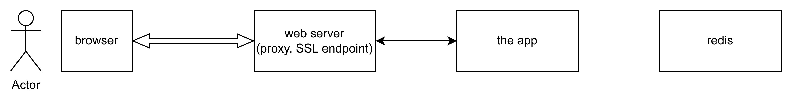
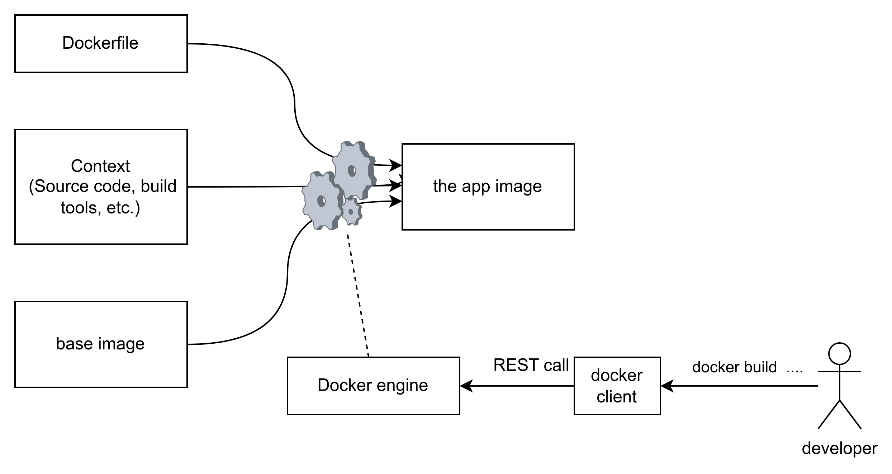
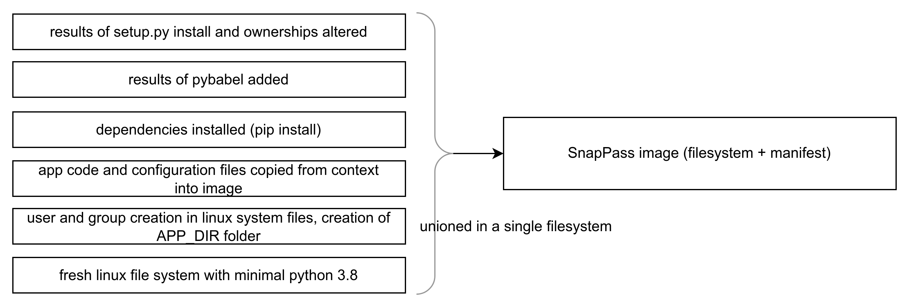

## Dockerizing and deploying a 3 tiers web application on Kubernetes
------------------------------------

**goals and plan:**
We want to deploy the `SnapPass` application (https://github.com/pinterest/snappass) having the following architecture:
.
The components are as follows:
- *web server* is used as a proxy to the app and an SSL end point.
- *the app*, a web application running over python and build with Flash framework. This application is freely available on github as python source, and the concept can be tested [online here](https://snappass.ch/) (an application to share password in an URL format).
- *redis*, used as database, cache, etc. for key=value data. Have a look on its features as this is a widely used component in software architceture.

Here is what we will be doing in this lab:
- dockerize the SnapPass application
- create a custom image for the web server from nginx
- deploy on top of kubernetes. I'll assume you already have a kubernetes (k8s) cluster.

Step 1: Dockerize SnapPass
=======
Take a look at the SnapPass github repository. The developers already prepared for you the recipe (I mean, the Dockerfile) for creating the **container image** of the SnapPass app. This means both building app from source code and packaging it in a docker image format. As a side note, I expect that they've already published the image in the **public Docker registry** (I did not check). You can use it, but the goal here is to understand the content of a basic Dockerfile.

The creation process of the docker image is described the following image. . you use your `docker` command line in order to control the docker engine, creating the image. (Yes, containers and their images are handled at the engine, never in the client tool.)

Here is the Dockerfile used for the build (found at [the SnapPass repository](https://github.com/pinterest/snappass/blob/master/Dockerfile)):

```Dockerfile
FROM python:3.8-slim

ENV APP_DIR=/usr/src/snappass

RUN groupadd -r snappass && \
    useradd -r -g snappass snappass && \
    mkdir -p $APP_DIR

WORKDIR $APP_DIR

COPY ["setup.py", "requirements.txt", "MANIFEST.in", "README.rst", "AUTHORS.rst", "$APP_DIR/"]
COPY ["./snappass", "$APP_DIR/snappass"]

RUN pip install -r requirements.txt

RUN pybabel compile -d snappass/translations

RUN python setup.py install && \
    chown -R snappass $APP_DIR && \
    chgrp -R snappass $APP_DIR

USER snappass

# Default Flask port
EXPOSE 5000

CMD ["snappass"]
```

This file describes what a developer would do manually in order to build the web application. Here is how you should interpret it:
- start with the filesystem that one would find in a linux system having python 3.8,
- add to the files `/etc/passwd` and `/etc/groups` within this filesystem the user snappass by means of the useradd/groupadd command. then create the folder snappass under `/usr/src` (the APP_DIR)
- continue so on. Every command will cause the docker engine to create a container using the previously created image, performs modifications in it then freeze the container to get the new intermediary image, until the end of Dockerfile.
- Note that in addition to the filesystem, a Docker container image also include a manifest file which groups all configuration set in Dockerfile, like the base image, the environment variables (ENV), the user identity underwhich initial process will run (USER) within the container and the command (CMD) for creating that process. you have to **inspect** (docker image inspect ... ) to view these information 


In order to create the image, you have to use the docker build command.

Step 2: Create nginx web server
=======
The nginx server configuration is located in `/etc/nginx` and is divided into different files. The main files are the following:
- `/etc/nginx/nginx.conf` : for the server general configuration like log files location and logging severity, ssl certificates, loaded modules, etc. 
- `/etc/nginx/sites-available/snappass.conf` : for the particular virtual host that will host the snappass app
- ssl configuration is located in the `/etc/ssl` and is out of scope of this lab.

The nginx container image is shipped with default configuration (a default web site, with no ssl, no proxying,). All you have to do is to build a new image where selected files are replaced or added. For this purpose, you will use the following Dockerfile.

```Dockerfile
FROM nginx:stable-alpine

COPY snappass.local.conf /etc/nginx/conf.d/snappass.local.conf

EXPOSE 8080

CMD ["nginx", "-g", "daemon off;"]
```

What you have to do is to create new `snappass.local.conf` as follows:

```
server {
  listen 8080;
  server_name snappass.local;

  root /usr/share/nginx/snappass.local;

  location / {
    proxy_pass http://snappass:5000/;
    proxy_set_header Host $host;
  }
}
```

Step 3: Get the Redis cache
=====
Nothingo to do for this image. But you might want to check the parameterization possible for this image: Are there any environment vatiables, configuration parameters, volume claims associated with this container.


Step 4: Deploy the entire application stack on Kubernetes
=====
In this step, I assume you have a kubernetes cluster. Recall that the application is composed 
Here is the architecture of the applicatin:

The role of a k8s is to run containers in the way you define, allowing you to interconnect them, provide them with access to external networks, have storage resources, define networking services (DHCP, DNS, etc.), define operations requirerments (scaling, monitoring,), among others.

To express you requirements and make the deloyment, you have as a devops engineer two different ways:
- write down code (a **manifest file**) which describes the desired state of your application stack, or
- send commands to the k8s cluster manager one by one.

In both cases, you use the command client tool `kubectl` to send commands or the manifest file to the cluster manager node, where the the desired state configuration in the **etcd** database. Then, the k8s resource scheduler, the **kube-scheduler** selects nodes where to run containers, performs necessary config, etc. then start monitoring the deployment.

What is important is to know is which k8s objects you'll need to use in order to describe your deployment: **Service**, **Deployment**, **Pod**, **ReplicaSet**, **ConfigMap**, **PVC**, etc. 

You can start from the template of the official [Guestbook tutorialcheck the parameterization possible for this image: Are there any environment vatiables, configuration parameters, volume claims associated with this container?
](https://kubernetes.io/docs/tutorials/stateless-application/guestbook/) and modify it in order to create a manifest for the SnapPass app.

Note that there are some special attributes you will learn how to use later, like **tag**, **label**, **selectors**.


Questions
====
1. Check whether an image is available in Docker Hub. What are the available tags (if any) and their meanings?

2. What are the arguments for the build command? 

3. From the last deployment, we notice the use of the REDIS_HOST variable. How and where it is used? 

4. Check the parameterization possible for this image: Are there any environment vatiables, configuration parameters, volume claims associated with this container?

5. Examine the `snapss.local.conf` configuration file in nginx web server. Why does the server relays requests to the snappass host (in proxy_pass http://snappass:5000/)? What does the host snappass refers to?